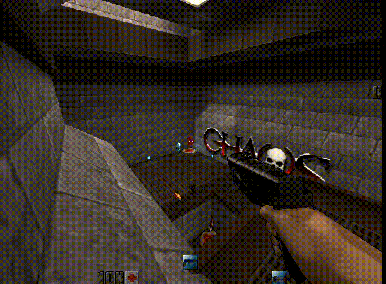
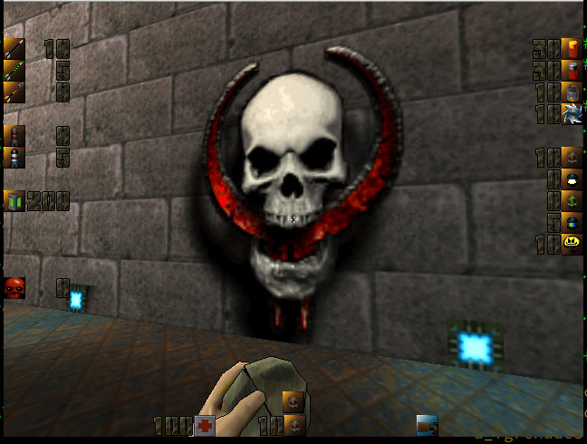
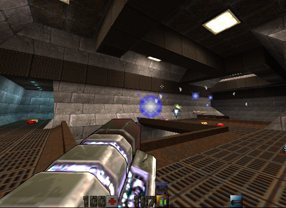

# Quake2 Chaos MOD

This **Chaos mod** patched to be buildable on x86_64 and compatible with recent Quake2 game.
This is based on the latest [source code](https://files.chaoticdreams.org/Chaos/ChaosDM/chaosdm_114b4src.zip) available.
The current version of Quake2 (>= 3.20) is usable as client only, as this code is still buggy and not really clean, you should used **yquake2** or **Q2Pro** instead. The code is in the ``chaossource`` directory.

The original **Chaos** mod is from [chaoticdreams.org](https://chaoticdreams.org/q2chaos/), all credits go to the original Chaos team.





[](https://www.youtube.com/watch?v=Yjb_YpavBUE)

[](https://www.youtube.com/watch?v=-80LPgSuP6w)


You need the [Chaos pack files and maps](https://files.chaoticdreams.org/Chaos/ChaosDM/q2chaos.exe) (this is a self autoextract rar file), and put them into a chaos directory, inside the quake2 directory.
You can find more original source at [files.chaoticdreams.org](https://files.chaoticdreams.org/Chaos/ChaosDM/)

Please use this mod with a recent release of quake2 projects, especially the server side, ie:

**yquake2**:
* [yamagi.org](https://www.yamagi.org/quake2/)
* [yquake2 source code](https://github.com/yquake2/yquake2)

**Q2Pro**:
* [q2pro](https://skuller.net/q2pro/)
* [q2pro source code](https://github.com/skullernet/q2pro)


# Usage

On server:
```
./q2proded +set dedicated 1 +set game chaos \
    +set hostname ginies.org  +set public 1 \
    +set allow_download 1 +exec autoexec.cfg \
    +set sys_console 2 +set sv_status_show 2
```

On client:
```
./q2pro +set game chaos +connect SERVERNAME +exec autoexec.cfg
```

# Binairies release

linux and Windows pre-built libs.
Bunzip and copy to ``QUAKE2/chaos`` directory


## chaos_bin/original_V1.15/

Orignal version of Chaos. ``master`` repository

## chaos_bin/devel/

Default repository ``plasma``.
This version include:

* add a menu
* add an observer mode (still buggy...)
* display status of all Ammo, your can use the command "showammo"
* add ```playerlist``` command
* add Jedi Force Push and Pull tractor! bind pull and push key, ie in your configuration file:
    * bind n "cmd push"
    * bind h "cmd pull"
* new effect while get explosion (taken from WOD mod):
    * items are moving if near the explosion
    * shockware effect
    * some debris
* cleanup windows DLL build warning (needs some more works...)
* fix a bug of not being able to use plasma is less than 50 cells.
* get bot less acurate with railgun
* No camp mode (from lithium mod)
    * use_nocamp (default 0)
    * camp_threshold (default 250)
    * camp_time (default 12)
    * camp_warn (default 10)
* Re-balance damage:
    * increase damage of chainsaw / Sword
    * decrase damage and life of turrets
* Sword can now block up to 70% of non explosive weapon (arrow, buzzsaw)
* fix re-spawn of weapons (more reliable and balanced)
* add a new "fast_respawn" CVAR to set the delay in seconds for respawning items/weapons (this time will be x4 for rate items like MegaHealth, Quad damage etc..)
* scanner and anti-gravity bolt use more cells (3 per seconds)
* bot up to 31 now (Carnage mode !)
* fix ban sword
* add nuke weapon
* add laser guided rocket launcher (based on WOD mod)
* add a plasma gun (based on marsilainen mod)
* use some other skins for bot (Chaos color and some others)
* add 'bot' to botname to quickly find them in the list of players
* Fix vortex and chainsaw ban
* Add a simple way to build windows DLL
* cleanup some code not needed
* fix some gcc warning at build time
* use gl1_polyblend instead of deprecated gl_polyblend
* botchat are disable by default (set to 0)




# Make your own Build and installation

## Linux

```
make build_release
```

Copy the ``gamex86_64.so`` to ``QUAKE2DIR/chaos/`` directory. 

## Windows

* install mgw-sdk
* backup the current Makefile
* use the ``Makefile_mingw` file
* check the ``.config`` in the directory (adjust path to mgw-sdk binairies)
* build the dll:
```
make -f Makefile_mingw
....
[LD] gamex86_64.dll
```
* copy the ``gamex86_64.dll`` to ``QUAKE2DIR/chaos/`` directory.
