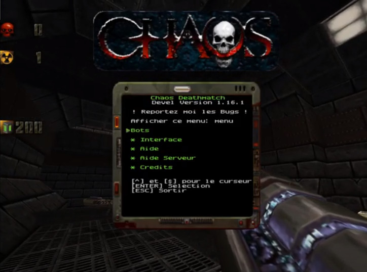

# Quake2 Chaos MOD

This **Chaos mod** is patched to be buildable on x86_64/x86 and compatible with recent Quake2 game.
This is based on the latest [source code](https://files.chaoticdreams.org/Chaos/ChaosDM/chaosdm_114b4src.zip) available. The original version is in master branch and only contains fixes. Other branches are development one and include various new features, and some of this new features came from other mods (Plasma, Rampage, Lithium, Wod etc...).

The current version of Quake2 (>= 3.20) is usable as client only, as this code is still buggy and not really clean (its seg fault while running it in dedicated server mode...) , you should used **yquake2** or **Q2Pro** instead. The code is in the ``chaossource`` directory.

The original **Chaos** mod is from [chaoticdreams.org](https://chaoticdreams.org/q2chaos/), all credits go to the original Chaos team.


[](https://youtu.be/DuxaoykNHQA)

You need the [Chaos pack files and maps](https://files.chaoticdreams.org/Chaos/ChaosDM/q2chaos.exe) (this is a self autoextract rar file), and put them into a chaos directory, inside the quake2 directory. Please delete the ``pak files`` and use the one gziped in this repo (unzip it), or you won't be able to get all new models, icons, sounds etc...

You can find more original source at [files.chaoticdreams.org](https://files.chaoticdreams.org/Chaos/ChaosDM/)

Please use this mod with a recent release of quake2 projects, especially the server side, ie:

**Q2Pro**:
* [q2pro](https://skuller.net/q2pro/)
* [q2pro source code](https://github.com/skullernet/q2pro)

**yquake2**:
* [yamagi.org](https://www.yamagi.org/quake2/)
* [yquake2 source code](https://github.com/yquake2/yquake2)


# Usage

On server:
```
./q2proded +set dedicated 1 +set game chaos \
    +set hostname ginies.org  +set public 1 \
    +set allow_download 1 +exec autoexec.cfg \
    +set sv_status_show 2
```
```
./q2proded +set dedicated 1 +set game chaos \
    +set hostname ginies.org  +set public 1 \
    +set allow_download 1 \
    +set sys_console 2 +set sv_status_show 2 \
    +set con_height 2 +set con_timestamps 1 \
    +set maxclients 16 \
    +set start_sword 1 \
    +set start_bodyarmor 1 \
    +set ban_defenceturret \
    +set ban_rocketturret \
    +set start_ammo_shells 10
```

On client:
```
./q2pro +set game chaos +connect SERVERNAME \
    +exec autoexec.cfg +set sys_console 2
```

# Binairies release

linux and Windows pre-built libs.
Bunzip and copy to ``QUAKE2/chaos`` directory


## chaos_bin/original_V1.15/

Orignal version of Chaos. ``master`` repository.

## chaos_bin/devel/

Default repository ``1.16``.
This version include:

* add C4 cells bomb: "togglec4" to trigger the explosion
* use RTX models for weapons, so nice! (https://www.moddb.com/mods/quake2-remodel/addons)
* adjust respawn of items, disable jet as this is causing issue....
* new nuke explosion using r_explode/tris.md2 from Rampage mod (https://www.moddb.com/mods/rampage-mod)
* add Dual MK23 as default gun (from Action mod https://www.moddb.com/mods/action-quake-ii)
* do not respawn sword if start_sword > 0, spawn a railgun instead
* dynamically show ammo of all weapons if you have such. hide if you don't have anymmore
* add a menu with many help: to get the Menu just type "menu" in the console
* add an observer mode (still buggy...)
* add ```playerlist``` command
* add Jedi Force Push and Pull tractor and Darth Vader force ! bind pull and push key, ie in your configuration file:
    * bind MOUSE4 "cmd push"
    * bind MOUSE2 "cmd pull"
    * bind MOUSE3 "cmd fkill"
* new effect while get explosion (taken from WOD mod ):
    * items are moving if near the explosion
    * shockware effect
    * some debris
* cleanup windows DLL build warning (needs some more works...)
* fix a bug of not being able to use Plasma is less than 50 cells.
* get bot less acurate with railgun
* No camp mode from Lithium mod (https://quake2lithium.github.io/)
    * use_nocamp (default 0)
    * camp_threshold (default 250)
    * camp_time (default 10)
    * camp_warn (default 8)
* Re-balance damage:
    * increase damage of chainsaw / Sword
    * decrase damage and life of turrets
* Sword can now block up to 70% of non explosive weapon (arrow, buzzsaw)
* fix re-spawn of weapons (more reliable and balanced)
* add a new "fast_respawn" CVAR to set the delay in seconds for respawning items/weapons (this time will be x4 for rate items like MegaHealth, Quad damage etc..)
* scanner and anti-gravity bolt use more cells (3 per seconds)
* bot up to 31 now (Carnage mode !)
* fix ban sword
* add nuke weapon
* add laser guided rocket launcher (based on WOD mod)
* add a plasma gun from Marsilainen mod (https://www.moddb.com/mods/plasma-rifle-mod-for-quake-2)
* use some other skins for bot (Chaos color and some others)
* add 'bot' to botname to quickly find them in the list of players
* Fix vortex and chainsaw ban
* Add a simple way to build windows DLL
* cleanup some code not needed
* fix some gcc warning at build time
* use gl1_polyblend instead of deprecated gl_polyblend
* botchat are disable by default (set to 0)


# Make your own Build and installation

## Build Chaos for Linux

```
make build_release
```

Copy the ``gamex86_64.so`` to ``QUAKE2DIR/chaos/`` directory. 

## Build Chaos for Windows

* install mgw-sdk
* use the ``Makefile_mingw` file
* check the ``.config`` in the directory (adjust path to mgw-sdk binairies)
* build the dll:
```
make -f Makefile_mingw
....
[LD] gamex86_64.dll
```
* copy the ``gamex86_64.dll`` to ``QUAKE2DIR/chaos/`` directory.


## Build QPakMan for Linux (and Chaos.pak file)
```
cd qpakman
cmake CMakeLists.txt
make
```

go to the ``chaossource/chaos_pak/`` directory
```
cd ../chaossource/chaos_pak/
../../qpakman/qpakman -game q2 * -o ../chaos.pak
.....
Storing: textures/e3u3/grate2_2.wal
Storing: textures/e3u3/grate1_6.wal
Storing: textures/e3u3/grate2_3.wal
--------------------------------------------------

Writing PAK directory
Closed PAK file
Packed 914 files (86.52 MB), with 0 failures
```
